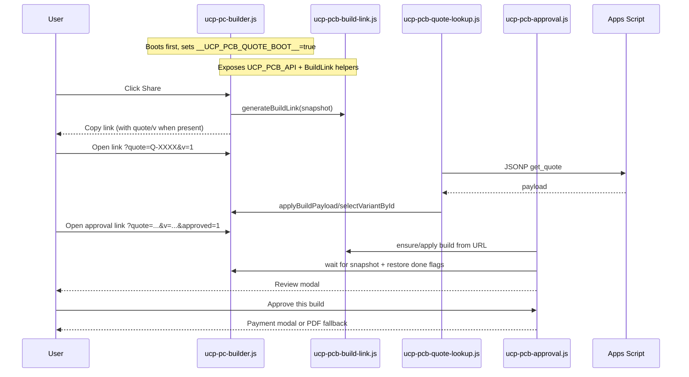

# UCP PC Builder - Dependency Map
Last updated: 2026-02-18

## Scope
- Focused on onboarding, quote, approval, and restore flows.
- File references are in `PC Builder 2`.

## Module Map (Mermaid)

```mermaid
graph TD
  L[sections/ucp-pc-builder.liquid] --> C[#ucp-pcb-config JSON]
  L --> R[#ucp-pcb-bundle-rules JSON]
  L --> B[assets/ucp-pc-builder.js]
  L --> BL[assets/ucp-pcb-build-link.js]
  L --> RQ[assets/ucp-pcb-request-quote.js]
  L --> ONB[assets/ucp-pcb-onboarding.js]
  L --> QL[assets/ucp-pcb-quote-lookup.js]
  L --> AP[assets/ucp-pcb-approval.js]

  B --> API[window.UCP_PCB_API]
  B --> LOG[window.UCP_PCB_LOG_EVENT]
  B --> PDF[window.UCP_PCB_PDF.open]
  B --> SNAP[window.__UCP_PCB_GET_BUILD_SNAPSHOT__]
  B --> QCTX[window.__UCP_PCB_QUOTE_CTX__]
  B --> QUOTEBOOT[window.__UCP_PCB_QUOTE_BOOT__ = true]

  BL --> API
  BL --> SHAREPAYLOAD[window.UCP_PCB_SharePayload]

  QL --> CFG[apps_script_webapp_url]
  QL --> API
  QL --> QLOOKUPDONE[window.__UCP_PCB_QUOTE_LOOKUP_DONE__]
  QL --> QLOOKUPPROM[window.__UCP_PCB_QUOTE_LOOKUP_PROMISE__]

  AP --> API
  AP --> SNAP
  AP --> BL
  AP --> PDF
  AP --> LOG
  AP --> QLOOKUPDONE
  AP --> QLOOKUPPROM
  AP --> RESTOREDONE[window.__UCP_PCB_BUILD_RESTORE_DONE__]
  AP --> RESTOREPROM[window.__UCP_PCB_BUILD_RESTORE_PROMISE__]

  ONB --> LOG
  ONB --> C

  RQ -. blocked by .-> QUOTEBOOT
```

## Runtime Flow (Quote + Restore + Approval)

## File Responsibilities (Target Area)
| File | Primary role | Reads | Writes/exports |
|---|---|---|---|
| `assets/ucp-pcb-onboarding.js` | First-visit onboarding + hints | `#ucp-pcb-config`, URL params, `localStorage` | `localStorage.ucp_pcb_onboarded`, onboarding helper funcs on `window` |
| `assets/ucp-pcb-quote-lookup.js` | Restore build from `quote` + `v` | URL params, `apps_script_webapp_url`, Apps Script JSONP | Applies build via `window.UCP_PCB_API.*`, sets `__UCP_PCB_QUOTE_LOOKUP_DONE__/PROMISE__` |
| `assets/ucp-pcb-approval.js` | Approval modal + payment actions after `approved=1` | URL (`approved/quote/v/dp/build`), config, restore flags, snapshot API | Renders/removes approval/payment modals, sets quote approved session key, logs events |
| `assets/ucp-pcb-request-quote.js` | Legacy quote request UI | Config + DOM totals | Blocked in current runtime by `__UCP_PCB_QUOTE_BOOT__` set by builder |
| `assets/ucp-pc-builder.js` | Core owner of modern quote/share state | Config, product endpoints, bundle rules | `UCP_PCB_API`, logging API, PDF API, quote context, restore flags |

## Key Global Contracts
- `window.UCP_PCB_API.getSnapshot()`
- `window.UCP_PCB_API.selectVariantById(categoryKey, variantId)`
- `window.UCP_PCB_API.applyBuildPayload(payload)`
- `window.UCP_PCB_BuildLink.generateBuildLink(snapshot, opts)`
- `window.UCP_PCB_BuildLink.applyBuildFromUrl(opts)`
- `window.UCP_PCB_LOG_EVENT(eventName, payload)`
- `window.UCP_PCB_PDF.open(opts)`
- `window.__UCP_PCB_GET_BUILD_SNAPSHOT__()`
- `window.__UCP_PCB_BUILD_RESTORE_DONE__`, `window.__UCP_PCB_BUILD_RESTORE_PROMISE__`
- `window.__UCP_PCB_QUOTE_LOOKUP_DONE__`, `window.__UCP_PCB_QUOTE_LOOKUP_PROMISE__`
- `window.__UCP_PCB_QUOTE_BOOT__` (legacy request-quote guard)

## Critical DOM IDs Used in These Flows
- Config/root: `#ucp-pcb-config`, `[data-ucp-pcb]`
- Onboarding: `#ucp-pcb-onboard-overlay`, `#ucp-pcb-onboard-modal`, `#ucp-pcb-onboard-close`, `#ucp-pcb-onboard-try-share`
- Quote modal: `#ucp-pcb-quote-modal`, `#ucp-pcb-quote-code`, `#ucp-pcb-quote-link`
- Share/quote actions: `#ucp-pcb-share`, `#ucp-pcb-request-quote`, `#ucp-pcb-mobilebar-share`, `#ucp-pcb-mobilebar-quote`
- Approval/payment: `#ucp-pcb-approval-reopen`, `#ucp-pcb-pay-overlay`, `#ucp-pcb-pay-modal`, `#ucp-pcb-pay-methods`, `#ucp-pcb-pay-proof`, `#ucp-pcb-pay-pdf`

## Event Hooks
- Emitted:
  - `ucp:pcb:share_copied`
  - `ucp:pcb:build_changed`
- Listened by:
  - onboarding: share copy + click logging
  - approval: live payment total refresh (`ucp:pcb:build_changed`)

## Current Important Note
- `assets/ucp-pcb-request-quote.js` is currently bypassed because `assets/ucp-pc-builder.js` sets `window.__UCP_PCB_QUOTE_BOOT__ = true` during boot.
