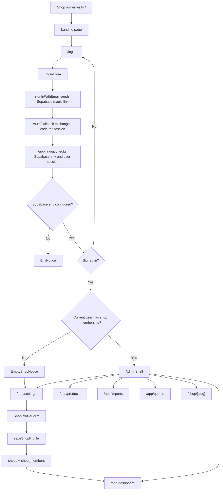
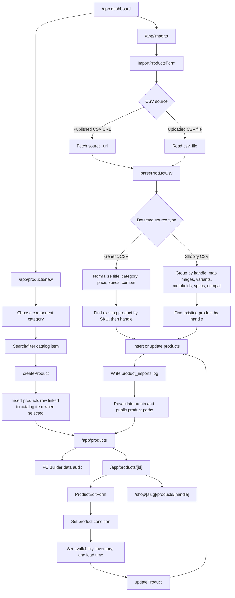
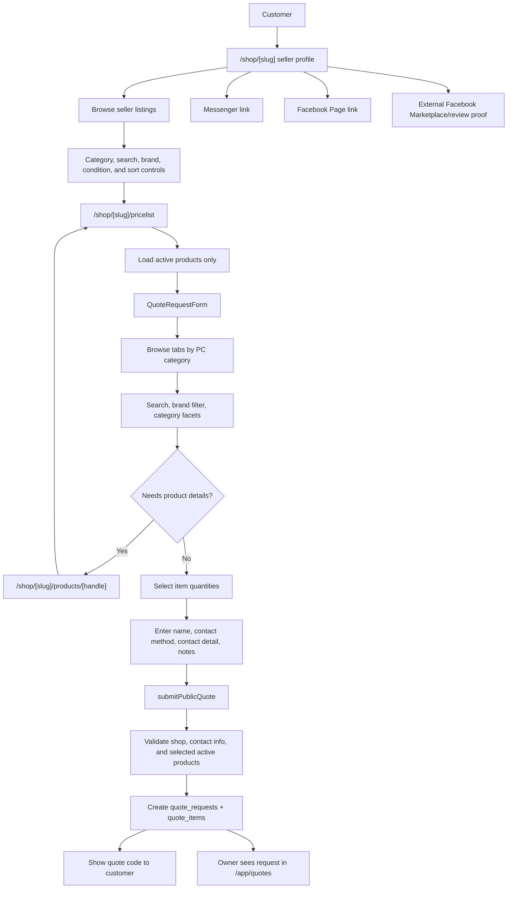
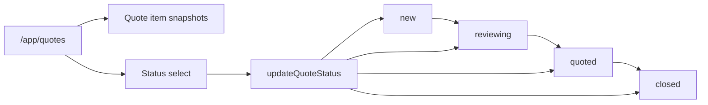
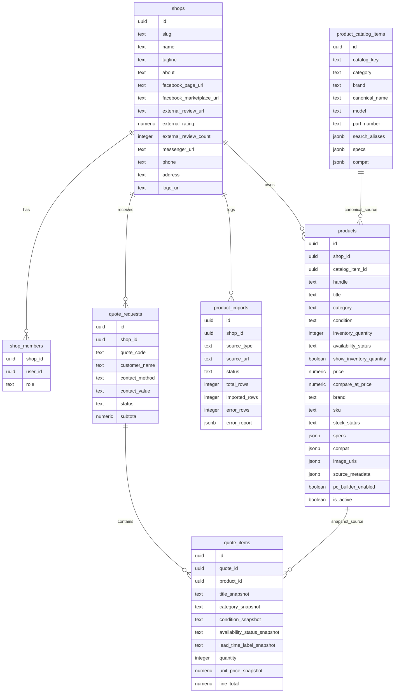

# Uncapped.gg Workflow

Current website workflow for the standalone Next.js + Supabase app.

This document maps the active app in `src/app`, the server actions in `src/server/actions.ts`, and the Supabase tables in `supabase/migrations`.

## Release 1 Scope

Release 1 is a multi-shop PC sales workflow:

- shop owner login by Supabase email magic link
- shop profile setup
- product import from a published CSV URL or uploaded Shopify CSV export
- product condition tracking for brand new, open box, used, and as-is items
- manual seller listing creation
- global product catalog linking for canonical product specs
- seller-managed inventory quantity and availability status
- product review and editing
- listings-first public seller profile
- public price list with filters
- public quote request form
- owner quote inbox and status tracking

Later phases are planned for PC Builder, stronger compatibility rules, shareable builds, bundles/promos, FPS Finder, branding, delivery/maps, and deeper Shopify integration.

## Owner Setup Flow

## Admin Product Flow

## Public Customer Flow

## Quote Management Flow

## Data Model

## Current Route Map

| Route | Audience | Purpose |
| --- | --- | --- |
| `/` | Public / owner | Marketing entry point with link to owner login. |
| `/login` | Owner | Sends Supabase email magic link. |
| `/auth/callback` | Owner auth | Exchanges Supabase auth code and redirects to `/app`. |
| `/app` | Owner | Protected dashboard with active products, quote count, and quoted value. |
| `/app/settings` | Owner | Create or update seller profile, contact links, about text, and external review proof. |
| `/app/imports` | Owner | Import products from published CSV URL or uploaded CSV file; shows import history. |
| `/app/products` | Owner | My Listings view with inventory, availability, condition, public links, builder readiness audit, and edit links. |
| `/app/products/new` | Owner | Guided Add Listing: choose category, search catalog, then enter seller price, condition, inventory, and availability. |
| `/app/products/[id]` | Owner | Listing editor for basics, condition, availability, visibility, pricing, and category-specific specs. |
| `/app/quotes` | Owner | Quote inbox with line items and status updates. |
| `/shop/[slug]` | Customer | Listings-first seller profile with filters, About, external review proof, Messenger, and Facebook links. |
| `/shop/[slug]/pricelist` | Customer | Active product list, category tabs, condition/brand/search filters, sorting, quantities, and quote request form. |
| `/shop/[slug]/products/[handle]` | Customer | Public product detail page for active products with handles and condition. |

## Product Categories

The product workflow uses PC Builder-compatible category keys:

- `processor` - CPU
- `motherboard` - Motherboard
- `memory` - RAM
- `gpu` - GPU
- `ssd` - SSD
- `cpucooler` - CPU Cooler
- `powersupply` - Power Supply
- `case` - Case
- `casefans` - Case Fans
- `other` - Other

These categories drive admin grouping, the public price list tabs, product facets, and the current builder audit.

## Important Behavior Notes

- Public shop pages read by `slug`; missing shops return `notFound`.
- Public product and price list pages only show products where `is_active` is true.
- Sold-out listings remain visible but cannot be selected in public quote forms.
- Pre-order listings are quoteable and require a fulfillment lead-time label.
- Inventory quantity is seller-managed and is not automatically decremented by quote requests.
- Exact inventory is only public when `show_inventory_quantity` is enabled for that listing.
- Seller listings can link to a global `product_catalog_items` row so canonical specs are inherited from the catalog.
- Catalog-linked listings keep seller-specific title, condition, price, inventory, and availability separate from canonical specs.
- Product handles are generated internally for public URLs and are not part of the normal seller listing form.
- Admin routes under `/app` require Supabase env values and an authenticated user.
- `getCurrentShop` currently uses the first shop membership for the signed-in user.
- Product imports update existing rows by SKU or handle. Shopify CSV imports prefer handle matching.
- Blank or unknown import conditions preserve an existing product condition; new products default to `brand_new`.
- Quote items store title, category, condition, unit price, and line total snapshots so old quotes remain readable if product data changes later.
- Quote items also snapshot availability status and fulfillment lead time.
- Quote statuses currently support `new`, `reviewing`, `quoted`, and `closed`.

## Current To-Do

- Test public quote submission end to end.
- Use the `/app/products` audit and `/app/products/[id]` editor to fill missing compatibility/spec fields.
- Apply all Supabase migrations through `supabase/migrations/202607070002_product_catalog_items.sql` before relying on catalog-linked Add Listing.
